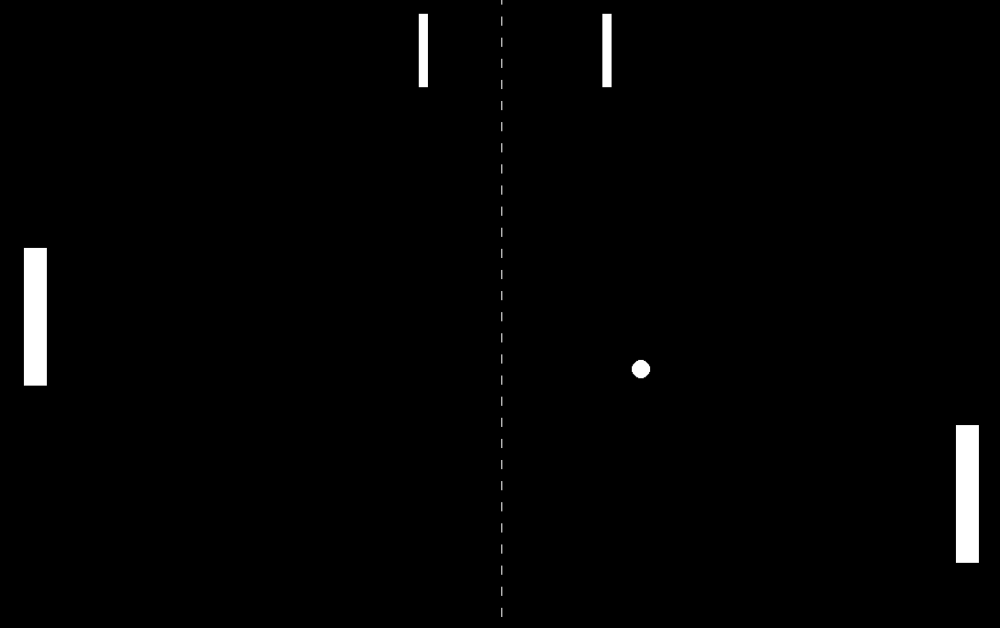
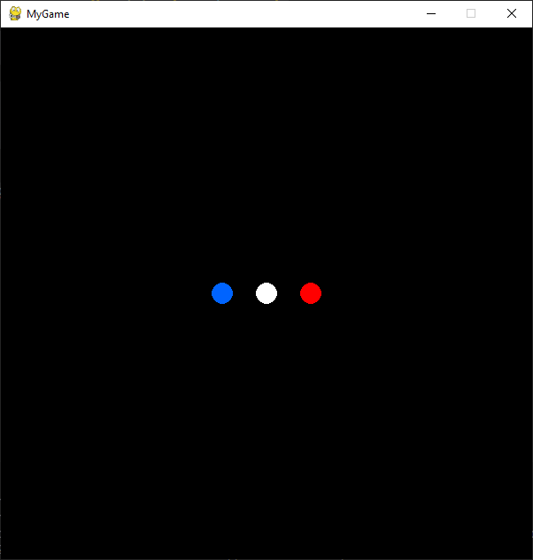

# Emotion Engine Py

## Overview
Emotion Engine is a small "toy engine" and framework built around Pygame, designed to facilitate rapid game development. This engine is specifically tailored for creating very simple games, visualizations, and quick testing of ideas. It provides essential tools and utilities that simplify the game development process, allowing developers to focus on creativity and experimentation rather than low-level details.

## Try the Pong game built with Emotion
```bash
git clone https://github.com/kstzl/EmotionEnginePy.git
cd EmotionEnginePy
python .\exemples\Pong\emotionPong.py
```


## Gettings started
### 1. Install EmotionEngine
```python
pip install EmotionEngine
```
### 2. Create a folder with this architecture:
```
📁 MyGame/
    📁 entities/
        📄 SuperCircle.py
    📁 levels/
        📄 level0.yaml
    📄 myGame.py
```
### 3. Copy this code in myGame.py :
myGame.py
```python
import os

from EmotionEngine.EmEngine import EmEngine

if __name__ == "__main__":
    current_directory = os.path.dirname(os.path.realpath(__file__))

    engineInstance = EmEngine(
        working_directory=current_directory,
        window_width=600,
        window_height=600,
        game_title="MyGame",
    )

    engineInstance.initialize()
    engineInstance.load_level("level0.yaml")

    engineInstance.main_loop()
```
### 4. Copy this in level0.yaml :
```yaml
entities:
    - name: BlueCircle
      class: SuperCircle
      position: [250, 300]
      color: [0, 100, 255]

    - name: WhiteCircle
      class: SuperCircle
      position: [300, 300]
      color: [255, 255, 255]

    - name: RedCircle
      class: SuperCircle
      position: [350, 300]
      color: [255, 0, 0]
```

## 5. Copy this in SuperCircle.py :
```python
import pygame

from EmotionEngine.entity.EmEntity import EmEntity

class SuperCircle(EmEntity):
    def __init__(self, creation_data: dict) -> None:
        super().__init__(creation_data)

        self.position = tuple(creation_data["position"])
        self.color = tuple(creation_data["color"])

    def on_draw(self, surface: pygame.display):
        pygame.draw.circle(
            surface, self.color, self.position, 12
        )


expose_entity("SuperCircle", SuperCircle)
```
## 6. Run your game
Run this command in your terminal :
```bash
python .\MyGame\myGame.py\
```
If you've done everything correctly, you should see a window open with 3 different-colored circles forming the French flag!



## Development Status
Emotion Engine is still under construction, and features may be added or modified as development progresses. It is a great tool for visualizing concepts, drawing, and testing ideas quickly. Your feedback and contributions are welcome!